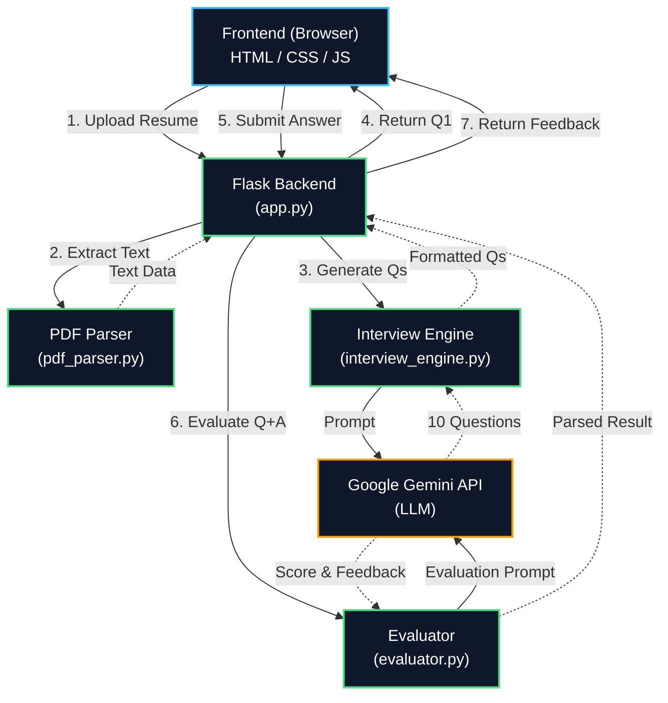

# InterviewX: AI-Powered Technical Interview Simulator

InterviewX is a full-stack web application designed to simulate technical and behavioral interviews. By leveraging advanced natural language processing, the application generates a tailored interview experience based directly on a candidate's uploaded resume.

## Live Application
Access the fully functional simulator here: [Link to Live App](https://interviewx-g4pp.onrender.com)

## System Architecture & How It Works

The application operates through a sequential pipeline, handling file parsing, dynamic content generation, and real-time evaluation.

1. **Document Parsing (pdf_parser.py):** When a user uploads their resume, the backend utilizes PyPDF2 to extract the raw text data. This ensures the subsequent questions are hyper-specific to the user's actual background and stated skills.

2. **Dynamic Question Generation (interview_engine.py):**
   The extracted text is securely passed to the Google Gemini AI model. The system is prompted to act as an expert technical interviewer, generating exactly 10 questions. These questions are a strategic mix of behavioral inquiries (utilizing the STAR method) and technical probes relevant to the candidate's domain.

3. **Real-Time Evaluation (evaluator.py):**
   As the user submits answers via the frontend interface, the text is sent back to the Gemini model for evaluation. The AI analyzes the response for clarity, depth, and relevance, returning:
   * A quantitative score out of 10.
   * Specific strengths identified in the answer.
   * Concrete areas for improvement.
   * A model answer hint to guide future responses.

4. **Frontend Interface (app.py & index.html):**
   The application is bound together using a lightweight Flask backend. The frontend is built with vanilla HTML, CSS, and JavaScript, featuring a modern, responsive design with asynchronous API calls to ensure a seamless, stateful user experience without page reloads.

## Technologies Used
* **Backend Framework:** Python, Flask
* **AI Integration:** Google GenAI SDK
* **Data Processing:** PyPDF2
* **Frontend:** HTML5, CSS3, JavaScript
* **Deployment:** Render / Gunicorn
